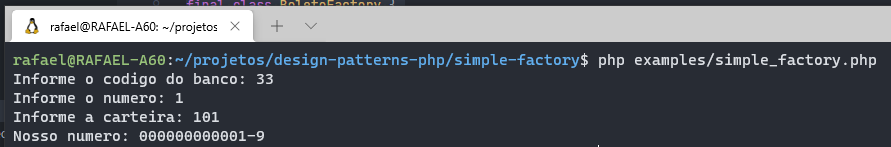

# Simple Factory com PHP

Um exemplo prático de utilização da técnica de **Simple Factory** com PHP.

## Requisitos

- Composer
- PHP 8.0 ou superior

## Utilização

Utilizar o composer para gerar o autoload das classes.

```shell´
composer install
```

Abrir o terminal na raiz do projeto e rodar os exemplos.

```shell´
php examples/simple_factory.php
```



## Mais informações

https://rafaelcouto.com.br/simple-factory-com-php